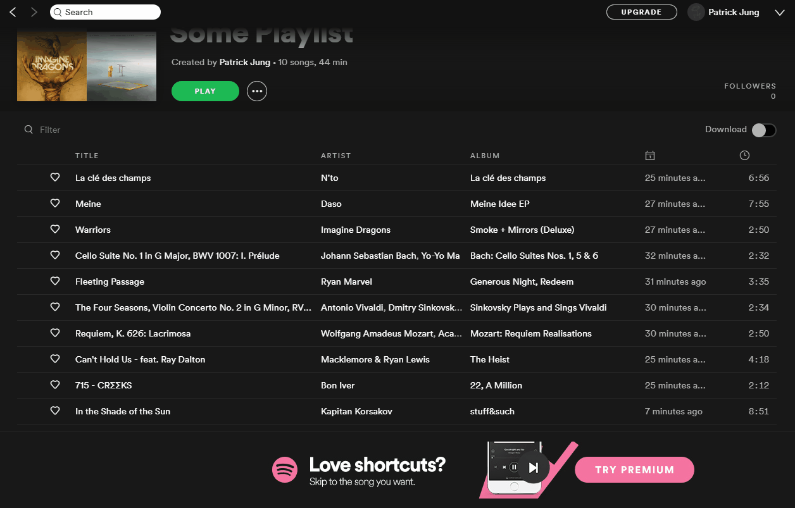

# Spotify to YouTube Playlist Converter

## Website Description

Ever wanted to share songs with a person without having to link your personal playlist? Perhaps you have Spotify Free and the ads bother you? To combat this, you can convert your Spotify playlist to a Youtube playlist. But even here, websites may prompt Spotify credentials or want you to register, and you can't bother trusting the website for such a small task.

This is a website dedicated to supporting those needs; you simply link a Spotify playlist or album and let it do the work. The method used only supports <b>up to 50 unique songs per playlist</b> due to YouTube's set limit for anonymous playlists.

Try it [here](https://ptjung.github.io/Spotify-Youtube-Converter)!

## Known Bugs

* Pairs of songs with incredibly similar names may be thought of as the same song, skipped due to duplicate handling
* This service shares a number of requests in a timeframe and can run out at any point temporarily
* Invalid URIs with the correct link format will convert forever
* In rare occasions, different YouTube videos will be selected

## Changelog

(March 7, 2020)
* Slight improvement to Spotify-YouTube-Converter.
  * Now notifies the user when too many requests have been made
  
(March 1, 2020)
* Improvements to Spotify-YouTube-Converter.
  * Bug fix: linking errors caused the converter to stop working
  * Bug fix: songs with special characters might not convert
  * Improved the time it takes to convert a playlist
  * Improved the rate of success for song picking
  * Reduced the number of search query requests sent to Google
  * Added conversion animation

(February 9, 2020)
* Quick patches to Spotify-YouTube-Converter.
  * Bug fix: the text forms do not reset on refresh
  * Bug fix: the "finish" event happens too early
  * Improved the YouTube picking algorithm
  * Improved website error reporting

(February 8, 2020)
* Bug fixes to Spotify-YouTube-Converter.
  * Bug fix: larger playlists do not have all of their songs converted
  * Bug fix: permanent freezing when converting specific songs
* Released Spotify-YouTube-Converter.
